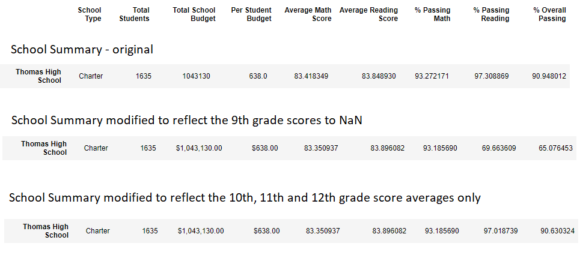

# School_District_Analysis

## School District Analysis Overview
The analysis requested was done to review the overall data and remove the grades that reflect the academic dishonesty.
Since we are not able to pinpoint exactly student grades affected, we have pulled all 9th grade math and reading scores 
and replaced them with "NaN", the results are concluded below. 

## School District Analysis Results
1. Affect on District Summary:
  ~ If the NaN scoring had not been removed from the overall percentages we would have seen a much larger affect on the District
Summary, since we removed the data and adjusted to just reflect the 10th, 11th and 12th graders, we found the District Summary
only adjusted by around a .3 percent. 

2. Affect on School Summary:
  ~ On the contrary, in the School Summary before replacing the percentages to match the 10th, 11th and 12th grade averages only. We 
see very clearly the change of the 9th grade scores dropped the % Passing Math and Reading and % Overall Passing by over 25% for the averages. 
The original Summary numbers match within close percentages to the reworked modified summary reflecting the averages of only the 10th,
11th and 12th grade scores - as shown below:

## Thomas High School performance change: 9th Grade score replacement affected the following:
   1. Math and Reading scores by grade - entire 9th grade scoring reduced to NaN
   2. Scores by school spending - less than 1% change for scores by the school spending (remained in same bracket)
   3. Scores by school size - less than 1% change for scores by the school size (remained in same bracket)
   4. Scores by school type - no change for school type

## School District Analysis Summary
- The four major changes reflected in the change of the misrepresented grades:
  - The Math percentage dropped from 93.8% to 66.9%, a drop of about 27%.
  - The Reading percentage dropped from 97.3% to 69.9%, a drop a little over 27%. 
  - The Overall percentage dropped from 90.9% to 65%, a drop of 25%. 
  - Removal of the NaN scores of 461 9th grade students led to the push of Thomas High School from mid lower 
  range to the top 2nd school.

